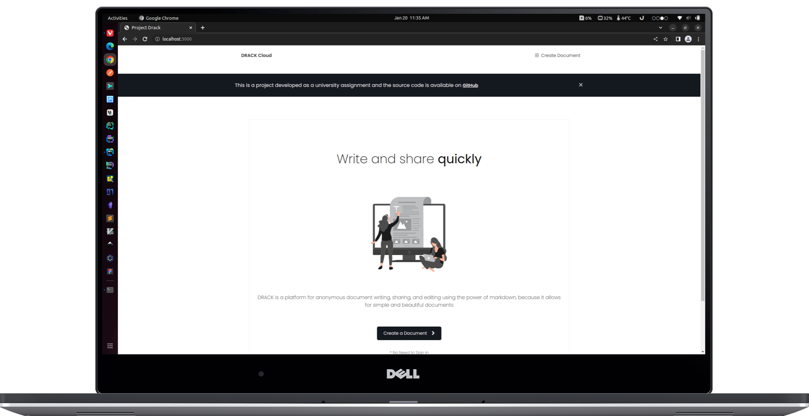

<div align="center">
    <h1>Drack Cloud</h1>
    <p>Write, share, and edit <b>documents</b> anonymously</p>
</div>



<hr>

> **Note**
>
> - This project was done as a university assignment of [University of Plymouth](https://www.plymouth.ac.uk/schools/school-of-engineering-computing-and-mathematics/computing) Computer Science
> - The source code of this project is not well optimized 
> - This app was tested on Linux only

# Introduction

DRACK is a platform for anonymous document writing, sharing, and editing using the power of markdown, because it allows for simple and beautiful documents.

# Install

## Install Required Tools

- [Node JS](https://nodejs.org/en/)
- [Mongo DB](https://www.mongodb.com)

## Build from Source

```shell
# Clone Repository

git https://github.com/las-nish/Drack.git .

# Install Packages from 'package.json'

npm install

# Run Application

npm start
```

**Note**

If you run this app locally, it will work. If you run this app in the cloud, it won't work. If an error occurs, change the `Server Variables` in the `Global Variables` section (`source/drack.js` - line `13` and `14`) according to your system

# Document

No documentation !

# Future

No future releases or updates

# License

[GNU GENERAL PUBLIC LICENSE](./LICENSE)